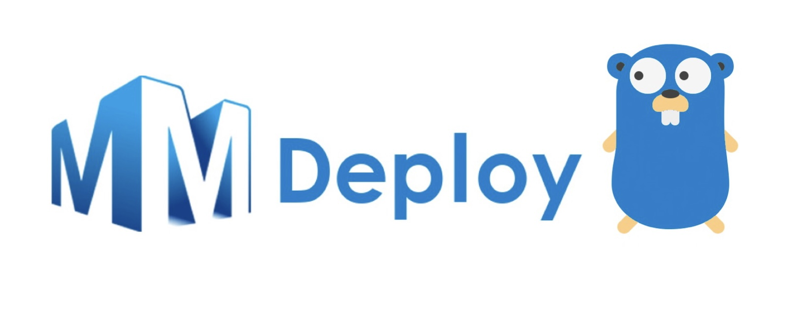

# MMDeploy x Golang

<div align="center">
  
  <div>&nbsp;</div>
  <div align="center">
    <b><font size="5">OpenMMLab website</font></b>
    <sup>
        <a href="https://openmmlab.com">
        <i><font size="4">HOT</font></i>
      </a>
    </sup>
    &nbsp;&nbsp;&nbsp;&nbsp;
    <b><font size="5">OpenMMLab platform</font></b>
    <sup>
      <a href="https://platform.openmmlab.com">
        <i><font size="4">TRY IT OUT</font></i>
      </a>
    </sup>
  </div>
  <div>&nbsp;</div>
</div>

## Introduction

Go API for mmdeploy~

## Prerequisites

To make sure the building of this repo in success, you should install some pre-packages.

The following guidance is tested on Ubuntu OS on x86 device.

**Step 1.** Install Golang and setup the envronment for it.

**Step 2.** Download and install pre-built mmdeploy package and onnxruntime. In this guidance, we choose a MMdepoloy prebuilt package target on ONNXRUNTIME-linux-x86.

```bash
wget https://github.com/open-mmlab/mmdeploy/releases/download/v0.8.0/mmdeploy-0.8.0-linux-x86_64-onnxruntime1.8.1.tar.gz
tar -zxvf mmdeploy-0.8.0-linux-x86_64-onnxruntime1.8.1.tar.gz
pushd mmdeploy-0.8.0-linux-x86_64-onnxruntime1.8.1
export MMDEPLOY_DIR=$(pwd)
export LD_LIBRARY_PATH=$MMDEPLOY_DIR/build/install/lib:$LD_LIBRARY_PATH
export LIBRARY_PATH=$MMDEPLOY_DIR/build/install/lib:$LIBRARY_PATH
export CPATH=$MMDEPLOY_DIR/build/install/include:$CPATH
popd
wget https://github.com/microsoft/onnxruntime/releases/download/v1.8.1/onnxruntime-linux-x64-1.8.1.tgz
tar -zxvf onnxruntime-linux-x64-1.8.1.tgz
cd onnxruntime-linux-x64-1.8.1
export ONNXRUNTIME_DIR=$(pwd)
export LD_LIBRARY_PATH=$ONNXRUNTIME_DIR/lib:$LD_LIBRARY_PATH
```

## Quickstart
 
After setting up the above instructions, you can use Go language to build your fantastic applications powered by MMDeploy!
Take a look by running some examples!

### Models and Testdata

You can

* Directly use converted models [here](https://drive.google.com/drive/folders/1CBdNu2TPAEw4rvKV-3cZNrmjlvtLOOU1?usp=sharing) ^_^
* Or follow [MMDeploy documentation](https://mmdeploy.readthedocs.io/en/latest/get_started.html#convert-model) to install and convert appropriate model

when you finish your download of the models, put them drectly in the fold named 
models in the go api path.
### Classifier API

Deploy image classification models converted by MMDeploy.

```bash
go build examples/ImageClassification.go
./ImageClassification cpu models/classification images/input_images/DemoImageClassification.png
```

### ObjectDetection API

Deploy object detection models converted by MMDeploy.

```bash
go build examples/ObjectDetection.go
./ObjectDetection cpu models/detection images/input_images/DemoObjectDetection.jpg
```

### Segmentation API

Deploy object segmentation models converted by MMDeploy.

```bash
go build examples/Segmentation.go
./Segmentation cpu models/segmentation images/input_images/DemoSegmentation.png
```

### PoseDetection API

Deploy pose detection models converted by MMDeploy.

```bash
go build examples/PoseDetection.go
./PoseDetection cpu models/pose-detection images/input_images/DemoPoseDetection.png
```

### RotatedDetection API

Deploy rotated detection models converted by MMDeploy.

```bash
go build examples/RotatedDetection.go
./RotatedDetection cpu models/rotated-detection images/input_images/DemoRotatedDetection.jpg
```

### OCR API

Deploy text detection and text recognition models converted by MMDeploy.

```bash
go build examples/Ocr.go
./Ocr cpu models/text-detection models/text-recognition images/input_images/DemoOcr.jpg
```

### Restorer API

Deploy restorer models converted by MMDeploy.

```bash
go build examples/Restorer.go
./Restorer cpu models/super-resolution images/input_images/DemoRestorer.png
```

### TOSupport List
- [x] Classifier
- [x] Detector
- [x] Segmentor
- [x] Pose Detector
- [x] Rotated Detector
- [x] Text Detector
- [x] Text Recognizer
- [x] Restorer